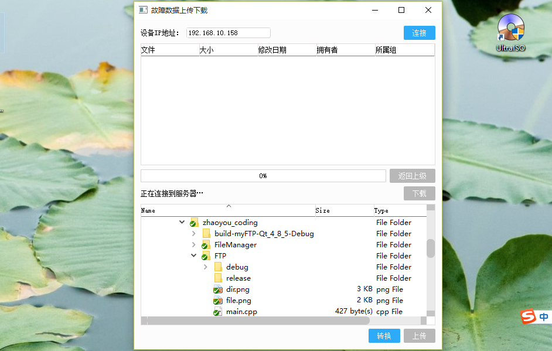

# Ftp-Client (FTP客户端)
### 简介：
This is a Ftp Client written in Qt 
这是一个ftp client，是用Qt和C++写成了，主要用到了QFtp这个类，客户端功能很简单，下面有介绍.

### 功能：

1. 这个客户端有个文本框用来输入ftp服务器地址，默认用户名是anonymous，即匿名登录，在程序中可以自己更改用户名和密码，但是没有在程序界面留出文本框用于/入，可以根据情况自己添加.
2. 默认的连接服务器端口为8021，程序中有一个端口宏定义，大家可以根据需要修改.
3. 客户端可以实现同一文件夹中的文件批量上传和下载，支持右键创建文件夹和批量删除文件.

### 预览

